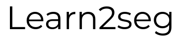

<p align="center">
  
</p>

<p align="center">
  Learn to segment images using only bounding box annotations!
</p>

## Features

The following package provides a framework to easily apply weakly annotated learning for segmentation. The packages aims to provide users to train their own model to deploy segmentation models that are only trained on bounding boxes. The intended use is for prototyping/research purposes.

- Implements Unet [1] as the base segmentattion model to learning model.
- Utilizes approaches mentioned in Simple Does It by Khoreva et al [2].

#### Current limitations:

- Works with fixed sized, grayscale images only

## Setup

#### Dependencies

Please make sure the following dependencies are installed:
- opencv >= 3.4.2
- tensorflow >= 1.13.1
- keras >= 2.2.4
- numpy >= 1.16.3
- yaml >= 5.1
- matplotlib >= 3.0.3

Add learn2seg to PYTHONPATH to run the scripts:
```bash
export PYTHONPATH=$PYTHONPATH:/path/to/learn2seg
```

## Usage
#### Data Preprocessing
In order to use the preprocessing scripts, users need to structure the first input data as the following:

```
dataset
└───images
|    ├─── 0.png
|    ├─── ...
|    └─── 1000.png
└───boxes
     ├─── 0.json
     ├─── ...
     └─── 1000.json
```

In each of the json file that corresponds to the images, please have the following entry for each bounding box:

```json
"shape": {"type": "box", "startX": 715, "startY": 295, "endX": 853, "endY": 500}
```

Once the data is processed, the following data structure is generated in the location where it is set in the config.

```
processed_dataset
│
└───train
|    ├───index.txt
|    ├───image
|    |    ├─── 0.png
|    |    ├─── ...
|    |    └─── 1000.png
|    └───label
|         ├─── 0.png
|         ├─── ...
|         └─── 1000.png
└───val
|    ├───index.txt
|    ├───image
|    └───label
└───test
     ├───index.txt
     ├───image
     └───label
```

Each generated label is a mask generated using the given initial bounding box coordinates. Index.txt files contain information to match back to the original location of the bounding box.

#### Training

Please copy the example config file and run the train script using the new configurations!
```bash
python scripts/train.py /path/to/config/file.yaml
```

## Citations

[1] [U-Net: Convolutional Networks for Biomedical Image Segmentation](https://lmb.informatik.uni-freiburg.de/people/ronneber/u-net/)

[2] [Simple Does It Weakly Supervised Instance and Semantic Segmentation](https://www.mpi-inf.mpg.de/departments/computer-vision-and-machine-learning/research/weakly-supervised-learning/simple-does-it-weakly-supervised-instance-and-semantic-segmentation/)

[3] [Keras Implementation of Unet](https://github.com/zhixuhao/unet)

[unet]:https://github.com/zhixuhao/unet
[simple_does_it]:https://arxiv.org/pdf/1603.07485.pdf

## Disclaimer 

The following is an Artificial Intelligence Project done at Insight Fellowship.
